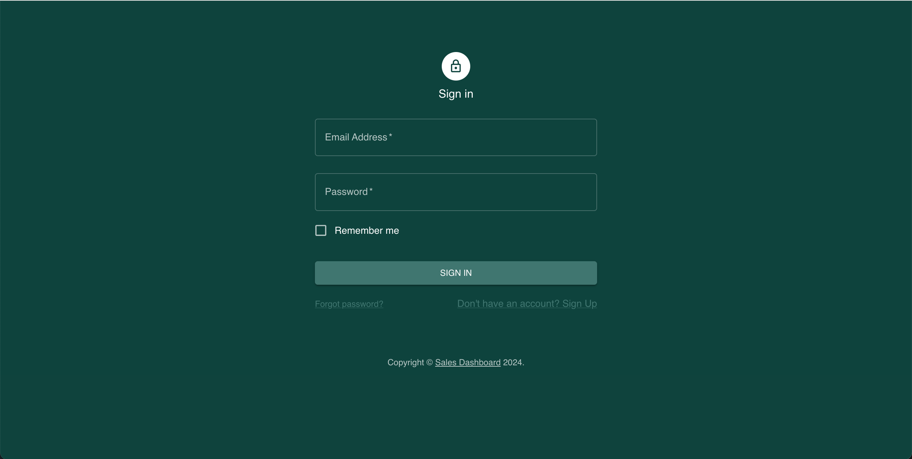
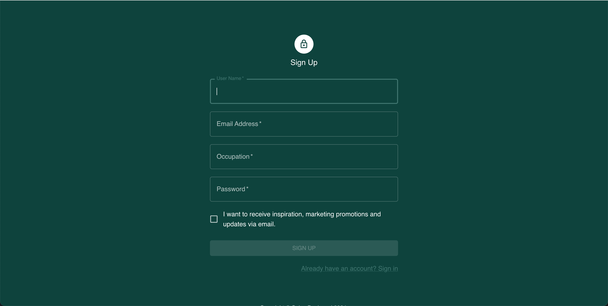
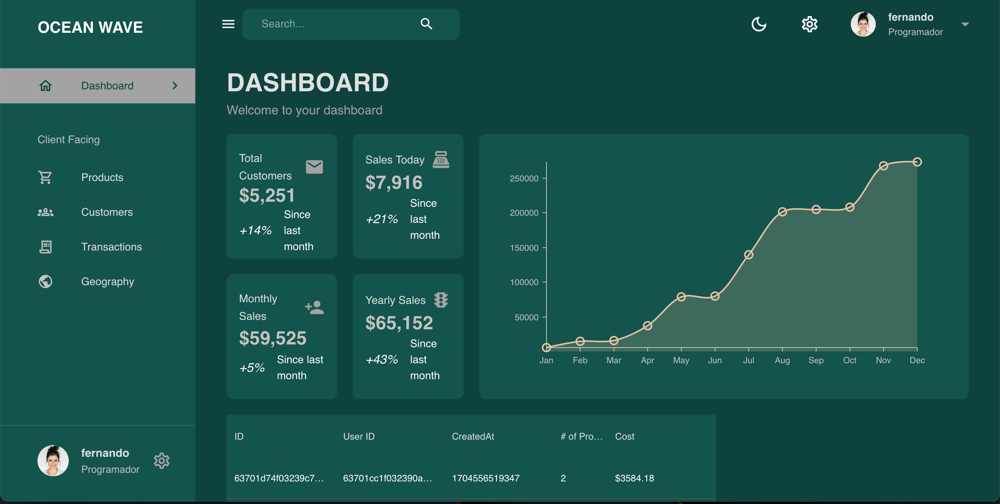
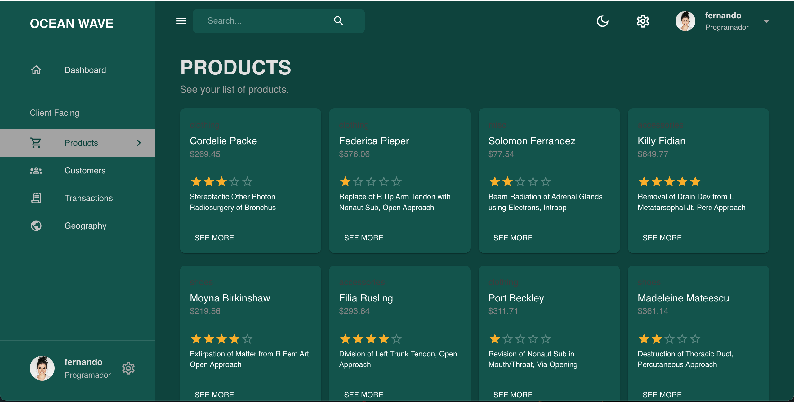
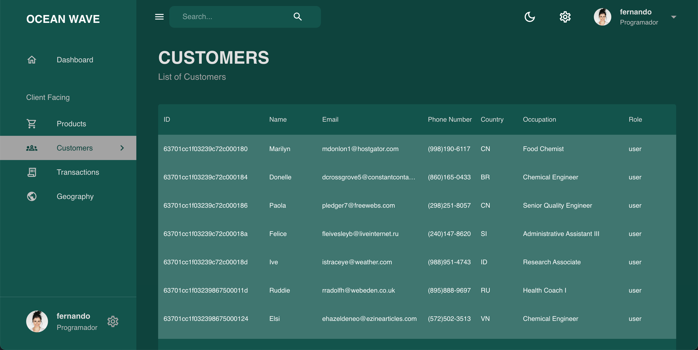
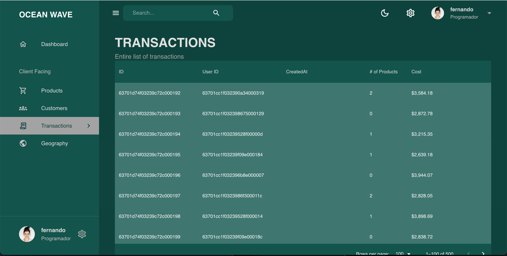
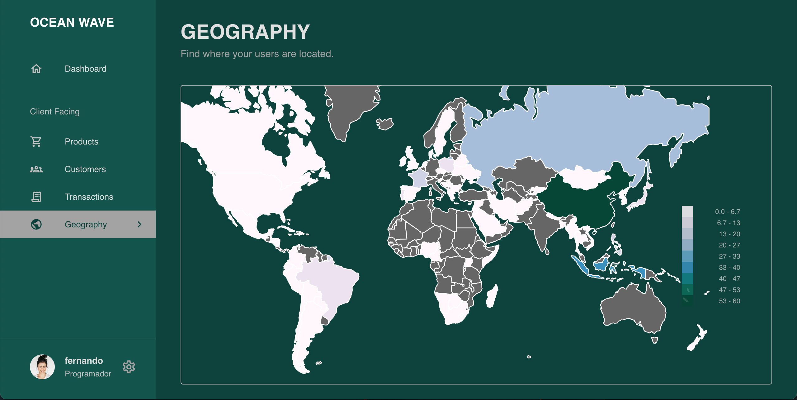

# Sales Dashboard
[](https://opensource.org/licenses/MIT)

## Description
Ocean Wave is a sales dashboard that functions as a centralized platform for monitoring and analyzing various facets of your sales operations, including products, customers, transactions, and performance metrics.

Crafted with a user-centric approach, our dashboard provides an intuitive and visually appealing interface. It goes beyond mere data presentation; it focuses on creating an immersive experience that facilitates informed, data-driven decision-making.

Key Features:

1. Real-Time Updates: Enjoy the advantage of real-time updates. Stay informed with instantaneous insights, ensuring that decisions are grounded in the most up-to-date information.

2. Authentication and Security: Security is our top priority. Robust authentication and authorization mechanisms guarantee that sensitive data is accessible only to authorized personnel, fortifying the protection of your business information.

## Table of Contents:

- [Overview](#Overview)
- [The Challenge](#Challenge)
- [User Story](#User-Story)
- [Acceptance Criteria](#Acceptance-Criteria)
- [Installation Instructions](#Installation-Instructions)
- [Usage Instructions](#Usage-Instructions)
- [Technologies Used](#Technologies-Used)
- [Walkthrough Video](#Walkthrough-Video)
- [Deployed Application Link](#Deployed-Application-Link)
- [Screenshots](#Screenshots)
- [Questions](#Questions)
- [Credits](#Credits)
- [License](#License)

# Overview

## Challenge

```md
"With your group, you’ll again conceive and execute a design that solves a real-world problem. 
In creating your first collaborative MERN-stack single-page application, you’ll combine a 
scalable MongoDB back end, a GraphQL API, and an Express.js and Node.js server with a React 
front end, implementing user authentication with JWT to build a user-focused platform. 
You’ll continue to build on the agile development methodologies you’ve used throughout this 
course. These include storing your project code in GitHub, managing your work with a project 
management tool, and implementing feature and bug fixes using the Git branch workflow and 
pull requests.

For this project, you should start from scratch. Doing so will allow you to revisit your 
front-end abilities in the context of React and solidify your understanding of working with 
multiple servers in a MERN application. Your skills have continued to improve since the 
first two projects, so naturally your approach will be different considering the experience 
you’ve gained with each new application you’ve built.

Your group will use everything you’ve learned throughout this course to create a MERN-stack 
single-page application that works with real-world data to solve a real-world challenge, with 
a focus on data and user demand. This project will provide you with the best opportunity to 
demonstrate your problem-solving skills, which employers will want to observe."
```

## User Story

```md
AS A developer tasked with creating a Sales Dashboard from scratch, 
I aim to build a robust and user-friendly platform that provides 
comprehensive insights into sales operations.
```

## Acceptance Criteria

```md
As a developer, I will choose the MERN (MongoDB, Express.js, React, Node.js) 
stack as the foundation for the Sales Dashboard.
As a developer, I will set up the frontend using React, creating a modular and 
responsive interface that caters to both desktop and mobile users.
As a developer, I will design and implement the Express.js backend, establishing 
the necessary routes, controllers, and middleware for seamless communication 
with the frontend.
As a developer, I will integrate MongoDB as the database, creating appropriate 
collections to store data related to products, customers, transactions, and 
performance metrics.
As a developer, I will incorporate real-time updates using technologies like 
WebSockets, ensuring users receive immediate insights into sales activities.
As a developer, I will implement a secure user authentication system, following 
best practices to protect sensitive data.
As a developer, I will create modular components for various aspects of the sales 
dashboard, including product listings, customer details, transaction summaries, 
and performance metrics.
As a developer, I will design a flexible framework that allows users to customize 
their dashboard views, providing a personalized experience.
As a developer, I will develop API endpoints to retrieve performance metrics, 
such as total sales, yearly sales, and units sold.
As a developer, I will implement API endpoints to fetch detailed information 
on individual sales transactions, facilitating thorough analysis.
As a developer, I will implement robust security measures, including secure 
data storage, encrypted communication, and protection against common 
vulnerabilities.
As a developer, I will create comprehensive documentation covering the project 
structure, API endpoints, and deployment instructions for future reference.
As a developer, I will write unit tests for critical components and functionalities 
to ensure the reliability and stability of the Sales Dashboard.
As a developer, I will deploy the Sales Dashboard on a suitable hosting platform, 
ensuring scalability and reliability.
```

## Installation Instructions

This web application is hosted on Render [https://render.com/](https://render.com/), eliminating the need for user installation.

## Usage Instructions

1. Accessing the Dashboard: Visit the [Deployed Application Link](#Deployed-Application-Link).
2. User Authentication: Enter your credentials (username/password) to log in. Ensure you have the necessary permissions to access the sales dashboard.
3. Dashboard Overview: Upon successful login, you'll be directed to the main dashboard. Familiarize yourself with the layout and navigation options.
4. Navigation Menu: Explore the navigation menu to discover different sections and features of the dashboard.
5. Navigate through each of the sections and consult the information provided.
6. Logout: Always log out when you've finished using the dashboard, especially if you're accessing it on a shared or public computer.

## Technologies Used
- Apolo Client [Web Page](https://www.apollographql.com/docs/react/)
- Apolo Client [Version 3.8.9](https://www.npmjs.com/package/@apollo/client)
- Emotion React [Web Page](https://emotion.sh/docs/@emotion/react)
- Emotion React [Version 11.11.3](https://www.npmjs.com/package/@emotion/react)
- Emotion Styled [Version 11.11.0](https://www.npmjs.com/package/@emotion/styled)
- Material UI [Web Page](https://mui.com/material-ui/)
- Material UI Icons [Version 5.15.5](https://www.npmjs.com/package/@mui/icons-material)
- Material UI Material [Version 5.15.5](https://www.npmjs.com/package/@mui/material?activeTab=versions)
- Material UI X Data Grid [Version 6.18.7](https://www.npmjs.com/package/@mui/x-data-grid)
- Nivo Rocks [Web Page](https://nivo.rocks/)
- Nivo Bar [Version 0.84.0](https://www.npmjs.com/package/@nivo/bar)
- Nivo Core [Version 0.84.0](https://www.npmjs.com/package/@nivo/core)
- Nivo Geo [Version 0.84.0](https://www.npmjs.com/package/@nivo/geo)
- Nivo Line [Version 0.84.0](https://www.npmjs.com/package/@nivo/line)
- Nivo Pie [Version 0.84.0](https://www.npmjs.com/package/@nivo/pie)
- Redux Toolkit [Web Page](https://redux-toolkit.js.org/)
- Redux Toolkit [Version 2.0.1](https://www.npmjs.com/package/@reduxjs/toolkit)
- GraphQL [Web Page](https://graphql.org/)
- GraphQL [Version 16.8.1](https://www.npmjs.com/package/graphql)
- JWT Decode [Version 4.0.0](https://www.npmjs.com/package/jwt-decode)
- React [Web Page](https://legacy.reactjs.org/)
- React [Version 18.2.0](https://www.npmjs.com/package/react/v/18.2.0)
- React Datepicker [Version 4.25.0](https://www.npmjs.com/package/react-datepicker)
- React Dom [Version 18.2.0](https://www.npmjs.com/package/react-dom?activeTab=versions)
- React Redux [Version 9.1.0](https://www.npmjs.com/package/react-redux)
- React Router Dom [Version 6.21.2](https://www.npmjs.com/package/react-router-dom)
- React Scripts [Version 5.0.1](https://www.npmjs.com/package/react-scripts)
- Redux [Web Page](https://redux.js.org/)
- Redux  [Version 5.0.1](https://www.npmjs.com/package/redux)
- Web Vitals [Web Page](https://sentry.io/for/web-vitals/)
- Web Vitals  [Version 3.5.1](https://www.npmjs.com/package/web-vitals)
- React Types [Web Page](https://react.dev/)
- React Types [Version 18.2.48](https://www.npmjs.com/package/@types/react)
- React Types Dom [Version 18.2.18](https://www.npmjs.com/package/@types/react-dom)
- Vite js [Web Page](https://vitejs.dev/)
- Vite [Version 5.0.11](https://www.npmjs.com/package/vite?activeTab=versions)
- Vite Plugin React [Version 4.2.1](https://www.npmjs.com/package/@vitejs/plugin-react)
- Eslint [Web Page](https://eslint.org/)
- Eslint [Version 8.55.0](https://www.npmjs.com/package/eslint/v/8.55.0)
- Eslint Plugin React [Version 7.33.2](https://www.npmjs.com/package/eslint-plugin-react)
- Eslint Plugin React Hooks [Version 4.6.0](https://www.npmjs.com/package/eslint-plugin-react-hooks)
- Eslint Plugin React Refresh [Version 0.4.5](https://www.npmjs.com/package/eslint-plugin-react-refresh)
- Node.js [Version 16.18.1](https://nodejs.org/en/blog/release/v16.18.1/)
- Express.js [Version 4.16.4](https://expressjs.com/)
- Visual Studio Code: [Website](https://code.visualstudio.com/)
- Render: [Website](https://render.com/)

## Walkthrough Video:
[Ocean Wave Sales Dashboard Video](https://drive.google.com/file/d/1o7uHRRf5AvDx5i1W6k1sn5nF1Sv0JqUN/view?usp=sharing)

## Deployed Application Link
[Ocean Wave web app](https://sales-dashboard-0x08.onrender.com/)

## Screenshots








## Questions?

If you have any questions related with Ocean Wave Sales Dashboard web app, feel free to reach us through email or GitHub:

[matthew.tingley@bellaliant.net](matthew.tingley@bellaliant.net) / [AzukiCoconut](https://github.com/AzukiCoconut)

[donpatey@outlook.com](donpatey@outlook.com) / [Don-Patey](https://github.com/Don-Patey)

[kiry362@gmail.com](kiry362@gmail.com)  / [Kirill777-web](https://github.com/Kirill777-web)

[guaranstone@gmail.com](guaranstone@gmail.com) / [HuiPan-Peter](https://github.com/HuiPan-Peter)

[fibarrafdec@gmail.com](fibarrafdec@gmail.com) / [fibarrafdec](https://github.com/fibarrafdec)

## Credits
This application has been created by © 2024 Group 1 

Matthew Tingley [AzukiCoconut](https://github.com/AzukiCoconut)

Don Patey [Don-Patey](https://github.com/Don-Patey)

Kirill Lazutin [Kirill777-web](https://github.com/Kirill777-web)

Hui Pan [HuiPan-Peter](https://github.com/HuiPan-Peter)

Fernando Ibarra [fibarrafdec](https://github.com/fibarrafdec)

## License & Copyright ©
This application is covered under the MIT License.
[](https://opensource.org/licenses/MIT)

### Copyright © 2024 Group 1
```md
Permission is hereby granted, free of charge, to any person obtaining a copy
of this software and associated documentation files (the "Software"), to deal
in the Software without restriction, including without limitation the rights
to use, copy, modify, merge, publish, distribute, sublicense, and/or sell
copies of the Software, and to permit persons to whom the Software is
furnished to do so, subject to the following conditions:

The above copyright notice and this permission notice shall be included in all
copies or substantial portions of the Software.

THE SOFTWARE IS PROVIDED "AS IS", WITHOUT WARRANTY OF ANY KIND, EXPRESS OR
IMPLIED, INCLUDING BUT NOT LIMITED TO THE WARRANTIES OF MERCHANTABILITY,
FITNESS FOR A PARTICULAR PURPOSE AND NONINFRINGEMENT. IN NO EVENT SHALL THE
AUTHORS OR COPYRIGHT HOLDERS BE LIABLE FOR ANY CLAIM, DAMAGES OR OTHER
LIABILITY, WHETHER IN AN ACTION OF CONTRACT, TORT OR OTHERWISE, ARISING FROM,
OUT OF OR IN CONNECTION WITH THE SOFTWARE OR THE USE OR OTHER DEALINGS IN THE
SOFTWARE.
```
